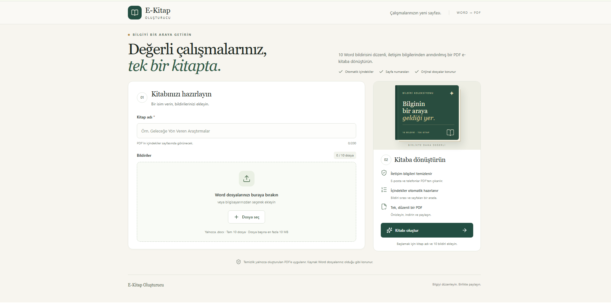
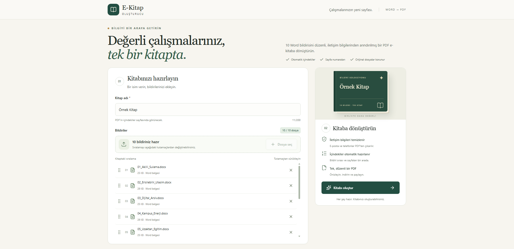
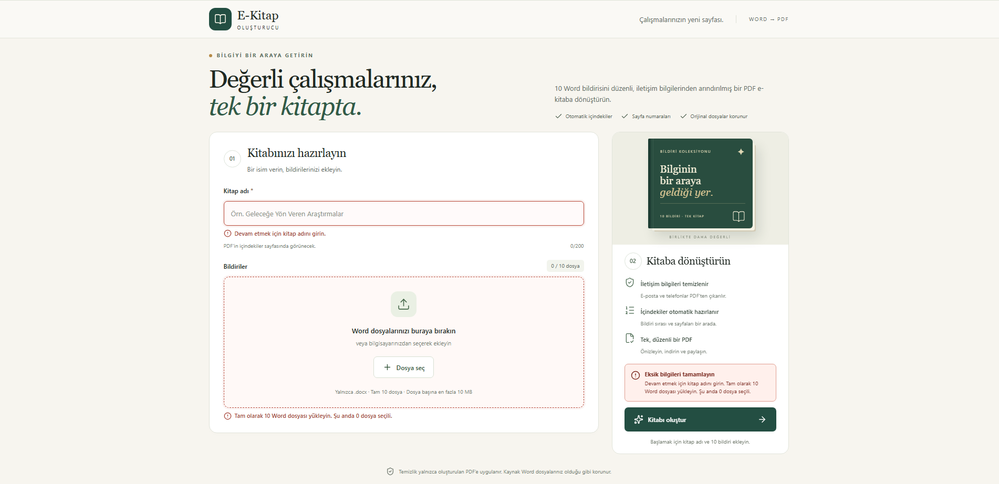
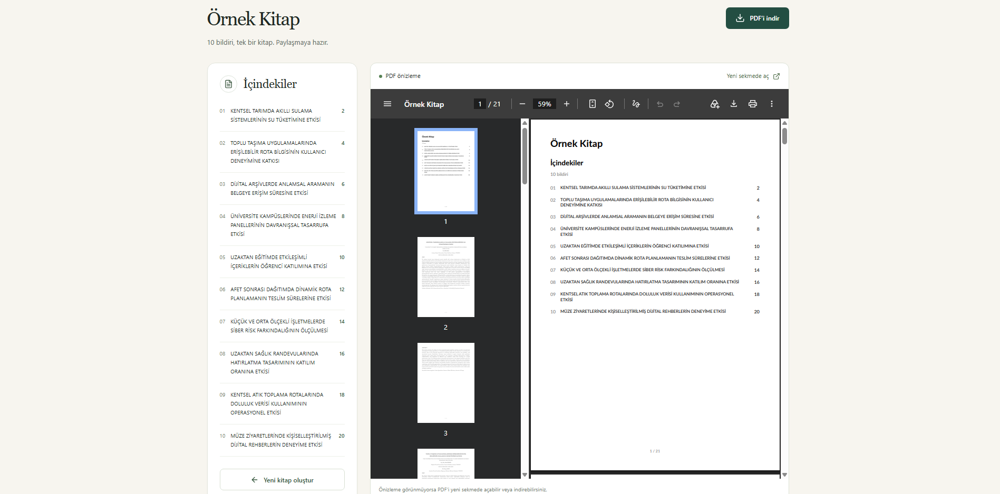

# E-Kitap Oluşturucu

10 Word bildirisinden iletişim bilgileri temizlenmiş, içindekiler ve sayfa numaraları bulunan tek bir PDF e-kitap üretmek için geliştirilen teknik case projesi.

## Mevcut aşama

Proje kurulumu, EF Core veri modeli, DOCX yükleme, Word okuma/iletişim temizliği, PDF üretimi ve durum yönetimi tamamlandı. Responsive React arayüzü; dosya sıralama, loading, anlaşılır hata, yeniden deneme, PDF önizleme ve indirme akışlarını sunar. Verilen 10 test bildirisiyle uçtan uca doğrulama yapılmıştır.

## Uygulama ekranları

### Kitap oluşturma



| Bildirilerin yüklenmesi ve sıralanması | Eksik alan doğrulamaları |
| --- | --- |
|  |  |

### Oluşturulan e-kitabın görüntülenmesi



## Gereksinimler

- .NET SDK 10.0.401 (sürüm `global.json` ile belirtilir; aynı SDK bandındaki yeni yamalar kabul edilir).
- Node.js 22.12 veya üzeri 22.x; mevcut geliştirme ortamı 22.16.0.
- SQL Server: yerel geliştirmede SQL Server 2022 Developer kullanılıyor.
- SSMS isteğe bağlıdır; uygulama ve migration için gerekli değildir.

## Proje yapısı

- `backend/EKitap.Api`: Web API, entity modelleri, DbContext, tablo yapılandırmaları ve migration dosyaları.
- `backend/EKitap.Tests`: xUnit ile yükleme, temizleme, üretim ve PDF API entegrasyon testleri. Testler izole SQLite belleği ve geçici dosya klasörleri kullanır; uygulamanın gerçek veritabanı MSSQL'dir.
- `backend/EKitap.Api/Documents`: temizlenmiş paragraf, bildiri ve üretilen PDF sonuç modelleri.
- `frontend`: React, TypeScript, Vite ve Tailwind CSS uygulaması; Vitest ve Testing Library testleri.
- `.config/dotnet-tools.json`: projeye özel EF Core komut satırı aracı.

## SQL Server ve backend kurulumu

Varsayılan yerel bağlantı `backend/EKitap.Api/appsettings.json` içinde:

```text
Server=.\MSSQLSERVER01;Database=EKitapDb;Trusted_Connection=True;Encrypt=True;TrustServerCertificate=True
```

Bu instance adı geliştirme bilgisayarına aittir. Başka bilgisayarda kendi SQL Server instance adınızı kullanın. Windows Authentication ile bağlanılır; veritabanı oluşturmak için Windows hesabınızın SQL Server'da yetkisi olmalıdır. `TrustServerCertificate=True` yerel geliştirme içindir.

Yerel ayarı değiştirmek için Git tarafından dışlanan `backend/EKitap.Api/appsettings.Local.json` oluşturabilirsiniz:

```json
{
  "ConnectionStrings": {
    "DefaultConnection": "Server=.\\SQLEXPRESS;Database=EKitapDb;Trusted_Connection=True;Encrypt=True;TrustServerCertificate=True"
  }
}
```

Alternatif olarak `ConnectionStrings__DefaultConnection` ortam değişkenini kullanabilirsiniz; ortam değişkeni JSON ayarlarının önüne geçer. Parolaları repoya eklemeyin.

Proje kökünden çalıştırın:

```powershell
dotnet restore backend/EKitap.slnx
dotnet tool restore
dotnet ef database update --project backend/EKitap.Api
dotnet run --project backend/EKitap.Api --launch-profile http
```

API: `http://localhost:5080`. `GET /api/health` SQL Server bağlantısını ve bekleyen migration bulunmadığını kontrol eder; hazırsa 200, hazır değilse 503 döner. Geliştirme ortamında OpenAPI belgesi `/openapi/v1.json` yolundadır. Migration otomatik olarak uygulama başlangıcında çalıştırılmaz; yukarıdaki komutla açıkça uygulanır.

## Kitap yükleme API'si

`POST /api/books`, `multipart/form-data` biçiminde `Name` ve tekrarlanan `Files` alanlarını kabul eder. Kitap adı 1–200 karakter olmalı; tam olarak 10 DOCX gönderilmelidir. Başarılı yanıt `201 Created` ve `Location: /api/books/{id}` içerir. Kitap `Pending` durumunda oluşturulur. Yanıtta kitap kimliği, adı, durumu ve dosya adı/sırasını içeren 10 bildiri yer alır; fiziksel dosya yolları dışarı verilmez.

`GET /api/books/{id}`, kayıtlı kitabı ve sıralı bildirilerini döndürür. Kayıt yoksa `404` döner. PDF üretimi `POST /api/books/{id}/generate` ile ayrıca başlatılır.

PowerShell 7 örneği (10 belge içeren kendi klasörünüzü belirtin):

```powershell
$files = @(Get-ChildItem -LiteralPath 'C:\TestBildirileri' -Filter '*.docx' | Sort-Object Name)
$book = Invoke-RestMethod -Method Post -Uri 'http://localhost:5080/api/books' -Form @{
    Name = 'Örnek Bildiri Kitabı'
    Files = $files
}
Invoke-RestMethod -Uri "http://localhost:5080/api/books/$($book.id)"
```

API dosyaları multipart isteğindeki sırayla kaydeder. Yukarıdaki istemci örneği göndermeden önce dosya adına göre sıralar. Aynı adlı dosyalar desteklenir; her birine ayrı kimlik verilir.

- Dosya başına en fazla 10 MiB, tüm istek için multipart ek yükü dahil 101 MiB sınırı uygulanır. Arayüz mesajlarında MB olarak belirtilir.
- Uzantı yanında DOCX ZIP paketi, içerik türü, ana belge ilişkisi ve belge/gövde XML yapısı kontrol edilir. DTD kapalıdır; paket en fazla 2048 öğe ve 50 MiB açılmış içerik içerebilir. Bu kontrol Word'ün tüm biçim özelliklerini doğrulayan kapsamlı bir şema doğrulaması değildir.
- Geçersiz ad/dosya/sayı ve dosya başına boyut sınırı için `400`, toplam istek sınırı için `413`, beklenmeyen kayıt hatalarında genel mesajlı `500` kullanılır. Hatalar Problem Details biçimindedir.
- Önce tüm dosyalar doğrulanır. Sonra dosyalar saklanır, kitap ve 10 bildiri tek `SaveChanges` transaction'ıyla kaydedilir. Yakalanan disk/veritabanı hatalarında o isteğin dosyaları temizlenir. Ani süreç kapanmasına karşı otomatik artık dosya taraması henüz yoktur.

## Frontend kurulumu

Ayrı terminalde:

```powershell
cd frontend
npm ci
npm run dev
```

Arayüz: `http://127.0.0.1:5173`. Vite geliştirme sunucusu `/api` isteklerini backend'in 5080 portuna yönlendirir. Böylece geliştirmede ayrıca CORS ayarı gerekmez. Üretim yayını bu aşamada yapılandırılmamıştır.

### Frontend ve responsive tasarım kararları

- React 19 ve TypeScript ile durum kontrollü tek sayfalı akış kullanılır. Sayfa yenilendiğinde URL'deki `book` kimliğiyle mevcut kitap geri yüklenir.
- Tailwind CSS derleme altyapısı ve küçük, projeye özel semantik CSS sınıfları birlikte kullanılır. Lucide React ikonları arayüzde görsel tutarlılık sağlar.
- Masaüstünde hazırlama ve kitap özeti iki sütunludur. Başlık alanı ve sağdaki özet paneli ana işlemleri ilk ekran görünümüne yaklaştıracak biçimde kompakt tasarlanmıştır. Dosya listesi uzadığında kendi içinde kaydırılır ve oluşturma paneli ekranda görünür kalır. 680 piksel altında form, özet, içindekiler ve PDF görüntüleyici tek sütuna geçer; dokunma hedefleri büyütülür ve dekoratif kitap kapağı gizlenir.
- Gerçek ilerleme yüzdesi backend tarafından sağlanmadığı için yanıltıcı bir yüzde gösterilmez. Bunun yerine yükleme ve PDF üretimi ayrı, hareketli durum mesajlarıyla açıklanır.
- Dosyalar seçildikten sonra adları, boyutları ve sıra numaraları gösterilir. Oluşturulacak kitaptaki sıra, her satırdaki tutamaç kullanılarak sürükle-bırak ile değiştirilebilir. Sıralama fare, dokunmatik ekran ve klavye kullanımını destekler; sıra numaraları bırakma işleminden sonra otomatik güncellenir.
- Eksik kitap adı veya 10 dosya koşulu; ilgili alanda belirgin çerçeve, alan mesajı ve oluşturma panelindeki hata özetiyle gösterilir. İlk eksik alana otomatik odaklanılır.

## Veri modeli

| Tablo | Alanlar |
| --- | --- |
| Kitaplar | Id, Name, Status, PdfFilePath, ErrorMessage, CreatedAt, CompletedAt |
| Bildiriler | Id, BookId, OriginalFileName, StoredFilePath, Title, SortOrder, StartPage, UploadedAt |

Bir kitap birden fazla bildiri içerir. `Bildiriler.BookId` zorunlu foreign key'dir. Kitap silinirse ilişkili bildiri kayıtları cascade ile silinir; bu yalnızca veritabanı kayıtlarını kapsar. Dosya silme işlemi henüz yoktur.

- Kitap durumu: `Pending`, `Processing`, `Completed`, `Failed`. Durum veritabanında metin olarak tutulur ve check constraint ile sınırlandırılır.
- Kitap adı zorunludur, en fazla 200 karakterdir ve boş/yalnız boşluk olamaz.
- Bildiri sırası 1–10 arasındadır. `(BookId, SortOrder)` benzersizdir; farklı kitaplar aynı sıra numarasını kullanabilir.
- Tam olarak 10 dosya zorunluluğu yükleme servisinde kontrol edilir. Veritabanındaki sıra kısıtı tek başına en az 10 kayıt bulunmasını garanti etmez.
- Başlık ve başlangıç sayfası henüz işleme yapılmadığında null olabilir. Başlangıç sayfası varsa pozitif olmalıdır.
- Tarihler uygulamada UTC olarak oluşturulur, SQL Server'da `datetimeoffset` türünde saklanır.
- Yalnızca iki iş tablosu vardır. EF Core'un kendi oluşturduğu `__EFMigrationsHistory` tablosu migration takibi içindir.

## Word okuma ve iletişim temizliği

`DocxReaderService`, Open XML SDK ile Word dosyasını salt okunur açar. Gövde paragrafları, tablo hücrelerindeki metinler, görünür bağlantı metni, satır/sekme ve açık sayfa sonları belge sırasıyla alınır. Metin parçaları (run) paragraf düzeyinde birleştirildikten sonra temizlenir; böylece farklı biçimlendirme parçalarına ayrılmış adresler de yakalanır. Kaynak DOCX değiştirilmez.

İçindekiler başlığı ilk kullanılabilir paragraftır. Bu paragraf 1000 karakteri aşarsa temizlenmiş dosya adı kullanılır. Türkçe karakterler korunur. Paragrafın tüm metin parçaları kalın/italik ise bu vurgu ve doğrudan tanımlanmış paragraf hizalaması PDF'e aktarılır.

`ContactInfoCleaner`, e-posta adreslerini ve Türkiye telefon biçimlerini temizler. `+` ülke kodlu uluslararası telefonlar da desteklenir. `E-posta`, `Email`, `Tel`, `GSM`, `Mobile` gibi doğrudan iletişim bilgisine ait etiketler ve boşta kalan ayraçlar kaldırılır. ORCID aralıkları açıkça korunur; etiket/ülke veya ulusal önek taşımayan sayılar otomatik telefon sayılmaz. Örneğin `3123431033` proje kodu olarak korunurken `Tel: 312 343 10 33` temizlenir. Bu yaklaşım yanlışlıkla araştırma verisi silinmesini azaltır; tüm dünya telefon biçimlerini veya yazıyla gizlenmiş adresleri tanıma iddiası yoktur.

Örnekler:

| Girdi | Sonuç |
| --- | --- |
| `E-posta: elif.kaya@example.org \| Tel: 0500 000 00 01 \| ORCID: 0000-0001-1000-0001` | `ORCID: 0000-0001-1000-0001` |
| `GSM: +90 (500) 000-10-07` | Boş metin |
| `Telefon: (0500) 000 00 05` | Boş metin |
| `ORCID 0000-0002-1825-0097` | Değişmez |
| `2026-09-27, %24 ve 120 katılımcı` | Değişmez |

## PDF üretimi

`PdfGeneratorService`, 1–10 sırasındaki bildirilerden A4 boyutunda PDF byte dizisi üretir. İlk bölüm tıklanabilir içindekilerdir; her bildiri yeni sayfada başlar. İçindekiler ve altbilgilerdeki numaralar QuestPDF'nin iki geçişli bölüm hesabından alınır. İçindekiler birden fazla sayfaya taşsa veya bildiri uzasa da başlangıç sayfaları buna göre hesaplanır. Sayfa numaraları içindekilerden başlayarak fiziksel PDF sayfalarıyla eşleşir.

Sonuç, PDF içeriğinin yanında toplam sayfa sayısını ve her bildiri kimliğinin gerçek başlangıç sayfasını içerir. Üretim API'si başlıkları, `StartPage`, PDF dosya yolunu ve tamamlanma zamanını birlikte kaydeder. Üretici, dışarıdan gelen modelde iletişim bilgisi bulunması ihtimaline karşı başlıkları ve paragrafları da temizler; kaynak dosya metadatası ve e-posta bağlantıları PDF'e taşınmaz.

### Üretim ve PDF uçları

- `POST /api/books/{id}/generate`: gövdesiz istekle üretir; başarıda güncel kitap bilgisini döndürür.
- `GET /api/books/{id}`: durum, hata, bildiri başlıkları/sayfaları ve tamamlanınca PDF bağlantıları.
- `GET /api/books/{id}/pdf`: tarayıcı içi görüntüleme (`inline`).
- `GET /api/books/{id}/download`: dosya indirme (`attachment`).

Durum akışı `Pending → Processing → Completed/Failed` şeklindedir. Başarısız kitap yeniden üretilebilir; tamamlanmış kitap için aynı istek mevcut sonucu döndürür. Koşullu veritabanı güncellemesi aynı kitabın eşzamanlı üretimini engeller (409). Hazır olmayan PDF için 409, bulunamayan kitap/dosya için 404 döner. Disk yolları ve teknik hata ayrıntıları istemciye verilmez.

PDF önce geçici dosyaya yazılır, sonra nihai adına taşınır. Başarısız üretimde PDF temizlenir, orijinal DOCX'ler korunur. PDF uçları byte-range isteklerini destekler; `no-store` ve `nosniff` başlıkları gönderilir.

Üretim HTTP isteği içinde çalışır; arka plan kuyruğu yoktur. İstek iptal edildiğinde hata durumu bağımsız zaman aşımıyla kaydedilir. Uygulamanın zorla kapanması veya veritabanının erişilememesi halinde kayıt `Processing` durumunda kalabilir; otomatik kurtarma bu case kapsamına henüz eklenmemiştir.

Kütüphaneler ve lisanslar:

- [Open XML SDK](https://github.com/dotnet/Open-XML-SDK): Word paketlerini okumak için, MIT.
- [QuestPDF](https://www.questpdf.com/license/community.html): PDF düzeni ve sayfalama için. Bu bireysel case çalışmasında Community lisansı yapılandırılmıştır. Başka bir kuruluşta kullanımda ilgili lisans koşulları kontrol edilmelidir; QuestPDF MIT olarak değerlendirilmemelidir.
- [Lato fontu](https://www.questpdf.com/api-reference/text/font-management.html): QuestPDF ile gelen font kullanılır; işletim sistemindeki fontlara bağımlılık oluşturulmaz.
- PdfPig: yalnızca testlerde üretilen PDF'in içeriğini ve sayfalarını bağımsız olarak okumak için.
- React, TypeScript ve Vite: istemci uygulaması ve üretim derlemesi.
- Tailwind CSS: responsive yardımcı sınıflar ve tasarım altyapısı, MIT.
- Lucide React: erişilebilir çizgi ikonları, ISC.
- dnd-kit: dosyaların erişilebilir sürükle-bırak sıralaması için, MIT.
- Vitest ve Testing Library: frontend kullanıcı akışı ve hata durumu testleri.

Kapsam sınırları: Word'ün özgün fontları, karmaşık stilleri, tablo çizgileri, görselleri, otomatik liste numaraları, üst/altbilgileri ve dipnotları birebir yeniden üretilmez. Ana gövde metni ve temel paragraf yapısı hedeflenir. Verilen 10 bildiri bu kapsamda doğrulanmıştır.

## Doğrulama

```powershell
dotnet build backend/EKitap.slnx
dotnet test backend/EKitap.slnx
dotnet ef migrations has-pending-model-changes --project backend/EKitap.Api
cd frontend
npm test
npm run build
```

`backend/verification/schema-smoke.sql`, test verilerini transaction içinde oluşturup geri alarak ilişki ve sıra/sayfa kısıtlarını kontrol eder. Migration uygulandıktan sonra `EKitapDb` üzerinde SSMS ile çalıştırılabilir. Kalıcı test verisi bırakmaz.

Yükleme adımındaki 17 otomatik test; başarılı yükleme, sıra ve dosya bütünlüğü, eksik/fazla dosya, geçersiz ad, uzantı ve bozuk paket, dosya boyutu, DTD reddi, bulunamayan kitap ve disk/veritabanı hatası sonrası temizliği kapsar. Ayrıca verilen 10 gerçek bildiri çalışan API ve MSSQL üzerinde yüklendi; saklanan kopyaların SHA-256 değerleri orijinallerle eşleşti. Geçici doğrulama kayıtları ve kopyaları sonrasında temizlendi.

Word/PDF testleri farklı telefon biçimlerini, bölünmüş run'ları, ORCID/tarih/sayı korumasını, paragraf sırasını, uzun içerik/çok sayfalı içindekileri ve gerçek PDF sayfa numaralarını kapsar. Kaynak belgeler repoya dahil edilmez. Gerçek örneklerle üretim testi için proje kökünde:

```powershell
$env:EKITAP_SAMPLE_DIRECTORY = 'C:\TestBildirileri'
$env:EKITAP_SAMPLE_OUTPUT = Join-Path (Get-Location) 'tmp\pdf-preview'
dotnet test backend/EKitap.slnx
```

Klasörde tam 10 DOCX bulunmalıdır. İkinci ortam değişkeni isteğe bağlıdır; verilirse `sample-book.pdf` ve sayfa eşlemesini içeren JSON üretilir. İlk değişken tanımlı değilse yalnız gerçek dosya testi atlanır; diğer testler kendi belgelerini üretir. Gerçek örnekler dahil 63 backend ve 3 frontend testi doğrulandı. Örnek PDF 21 sayfadır; 13 e-posta ve örnek telefonlar temizlenmiş, 3 ORCID ve iletişim satırları dışındaki tüm kaynak paragraflar korunmuştur.

## Bilinen sınırlamalar

Üretim API'si testleri kalıcı başlık/sayfa bilgisini, PDF görüntüleme/indirme ve byte-range yanıtını, bulunamayan veya hazır olmayan PDF'i, disk hatasından sonra temizliği/yeniden denemeyi, eşzamanlı isteği ve iptal sonrası hata durumunu kapsar. Verilen 10 bildiri çalışan API ve MSSQL üzerinde de uçtan uca üretildi; görüntüleme ve indirme çıktılarının SHA-256 değerleri eşleşti.

- Üretim HTTP isteği içinde eşzamanlı çalışır; dağıtık kuyruk ve yatay ölçekleme bu case kapsamında değildir.
- Uygulamanın üretim sırasında zorla kapanması halinde kitap `Processing` durumunda kalabilir. Zaman aşımına uğrayan kayıtlar için otomatik kurtarma görevi yoktur.
- Ani süreç kapanmasından sonra sahipsiz dosyaları tarayıp temizleyen bir bakım görevi bulunmaz.
- Word belgelerindeki karmaşık görsellerin, dipnotların ve biçimlerin birebir korunması hedeflenmez.
- Kimlik doğrulama, kitap silme, bulut depolama ve canlıya dağıtım case kapsamında uygulanmamıştır.

Orijinal dosyalar API projesinin web kökü dışında `Storage/books/{kitapId}/{bildiriId}.docx` yoluna kaydedilir; veritabanı yalnızca `books/...` göreli yolunu tutar. Dosyalar değiştirilmez ve statik dosya olarak yayınlanmaz. Kullanıcıdan gelen dosya adı fiziksel yolda kullanılmaz. `Storage` Git dışında tutulur. PDF aynı kitap klasöründe `book.pdf` olarak saklanır ve yalnız ilgili API üzerinden sunulur.

## Yapay zekâ kullanımı

Codex, case gereksinimlerinin analizinde ve uygulama adımlarının planlanmasında kullanıldı. Proje yapısı, EF Core modeli, API servisleri, React arayüzü ve test senaryoları geliştirilirken kod üretme ve gözden geçirme desteği sağladı. Verilen Word belgeleriyle PDF çıktısının metin, iletişim temizliği ve sayfa eşleşmeleri araç destekli testlerle doğrulandı. Üretilen kod, hata mesajları ve dokümantasyon teslim öncesinde kullanıcıyla birlikte gözden geçirildi.
